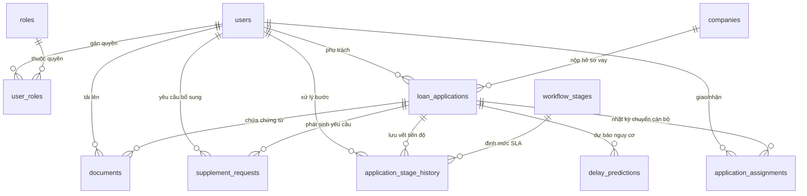

# THIẾT KẾ CƠ SỞ DỮ LIỆU & TỪ ĐIỂN DỮ LIỆU (DATA DICTIONARY)
## HỆ THỐNG QUẢN LÝ QUY TRÌNH XÉT DUYỆT HỒ SƠ VAY VỐN SME, TÍCH HỢP MÔ HÌNH DỰ BÁO NGUY CƠ CHẬM XỬ LÝ HỒ SƠ

- **Hệ quản trị CSDL**: PostgreSQL 16
- **ORM kết nối**: Prisma ORM (v6.19.0)
- **Tổng số thực thể**: 11 bảng

---

## 1. SƠ ĐỒ QUAN HỆ THỰC THỂ (ERD)

---

## 2. CHI TIẾT CÁC BẢNG DỮ LIỆU (DATA DICTIONARY)

### 2.1. Bảng `users` (Tài khoản người dùng nội bộ ngân hàng)
| Tên cột (Column) | Kiểu dữ liệu | Ràng buộc | Diễn giải |
| :--- | :--- | :--- | :--- |
| `id` | VARCHAR(36) / UUID | Primary Key | Mã định danh duy nhất của người dùng |
| `username` | VARCHAR(50) | Unique, Not Null | Tên đăng nhập vào hệ thống |
| `password_hash` | VARCHAR(255) | Not Null | Mật khẩu đã được băm mã hóa (bcrypt) |
| `full_name` | VARCHAR(100) | Not Null | Họ và tên cán bộ nhân viên |
| `email` | VARCHAR(100) | Unique, Not Null | Email nội bộ ngân hàng |
| `phone` | VARCHAR(20) | Nullable | Số điện thoại liên hệ |
| `branch_name` | VARCHAR(100) | Default 'Chi nhánh TP.HCM' | Chi nhánh công tác |
| `is_active` | BOOLEAN | Default TRUE | Trạng thái tài khoản (Hoạt động / Khóa) |
| `created_at` | TIMESTAMP | Default NOW() | Thời điểm tạo tài khoản |
| `updated_at` | TIMESTAMP | Auto update | Thời điểm cập nhật thông tin cuối |

### 2.2. Bảng `roles` (Danh mục vai trò người dùng)
| Tên cột (Column) | Kiểu dữ liệu | Ràng buộc | Diễn giải |
| :--- | :--- | :--- | :--- |
| `id` | VARCHAR(36) / UUID | Primary Key | Mã định danh vai trò |
| `code` | ENUM (`RoleCode`) | Unique, Not Null | Mã vai trò: `ADMIN`, `CBTD`, `THAM_QUYEN`, `QUAN_LY` |
| `name` | VARCHAR(100) | Not Null | Tên hiển thị của vai trò |
| `description` | TEXT | Nullable | Mô tả trách nhiệm quyền hạn |
| `created_at` | TIMESTAMP | Default NOW() | Thời điểm tạo |

### 2.3. Bảng `user_roles` (Phân quyền N-N giữa Người dùng và Vai trò)
| Tên cột (Column) | Kiểu dữ liệu | Ràng buộc | Diễn giải |
| :--- | :--- | :--- | :--- |
| `id` | VARCHAR(36) / UUID | Primary Key | Mã định danh bản ghi phân quyền |
| `user_id` | VARCHAR(36) | Foreign Key (`users.id`) | Khóa ngoại tham chiếu người dùng |
| `role_id` | VARCHAR(36) | Foreign Key (`roles.id`) | Khóa ngoại tham chiếu vai trò |
| `assigned_at` | TIMESTAMP | Default NOW() | Thời điểm gán vai trò |
*Ràng buộc duy nhất*: `UNIQUE(user_id, role_id)`.

### 2.4. Bảng `companies` (Hồ sơ Doanh nghiệp SME vay vốn)
| Tên cột (Column) | Kiểu dữ liệu | Ràng buộc | Diễn giải |
| :--- | :--- | :--- | :--- |
| `id` | VARCHAR(36) / UUID | Primary Key | Mã định danh doanh nghiệp |
| `tax_code` | VARCHAR(13) | Unique, Not Null | Mã số thuế (10 hoặc 13 chữ số) |
| `company_name` | VARCHAR(255) | Not Null | Tên đầy đủ của doanh nghiệp SME |
| `industry` | VARCHAR(100) | Not Null | Ngành nghề kinh doanh chính |
| `established_year`| INT | Not Null | Năm thành lập doanh nghiệp |
| `annual_revenue` | DECIMAL(18, 2) | Not Null | Doanh thu năm gần nhất (VNĐ) |
| `charter_capital` | DECIMAL(18, 2) | Not Null | Vốn điều lệ đăng ký (VNĐ) |
| `representative_name`| VARCHAR(100) | Not Null | Họ tên người đại diện pháp luật |
| `phone` | VARCHAR(20) | Not Null | Số điện thoại doanh nghiệp |
| `address` | VARCHAR(255) | Not Null | Địa chỉ trụ sở chính |
| `created_at` | TIMESTAMP | Default NOW() | Thời điểm lưu hồ sơ doanh nghiệp |

### 2.5. Bảng `loan_applications` (Hồ sơ Đề xuất Vay vốn SME)
| Tên cột (Column) | Kiểu dữ liệu | Ràng buộc | Diễn giải |
| :--- | :--- | :--- | :--- |
| `id` | VARCHAR(36) / UUID | Primary Key | Mã định danh hồ sơ vay |
| `application_code`| VARCHAR(30) | Unique, Not Null | Mã quản lý (Định dạng: `SME-YYYYMMDD-XXXX`) |
| `company_id` | VARCHAR(36) | Foreign Key (`companies.id`) | Tham chiếu doanh nghiệp vay |
| `loan_purpose` | TEXT | Not Null | Mục đích sử dụng vốn vay cụ thể |
| `loan_type` | ENUM (`LoanType`) | Not Null | `VAY_VON_LUU_DONG`, `VAY_DAU_TU_TSCD`, `THAU_CHI` |
| `proposed_amount`| DECIMAL(18, 2) | Not Null | Số tiền đề xuất vay ban đầu (VNĐ) |
| `official_amount`| DECIMAL(18, 2) | Nullable | Hạn mức chốt sau bước kiểm duyệt (ngưỡng 10 tỷ) |
| `approved_amount`| DECIMAL(18, 2) | Nullable | Số tiền được phê duyệt chính thức |
| `loan_term_months`| INT | Not Null | Thời hạn khoản vay (tính bằng tháng) |
| `interest_rate` | DECIMAL(5, 2) | Nullable | Lãi suất phê duyệt (%/năm) |
| `current_stage` | ENUM (`StageCode`)| Default `TIEP_NHAN` | Công đoạn hiện tại |
| `current_status`| ENUM (`LoanStatus`)| Default `RECEIVED` | Trạng thái chi tiết của hồ sơ |
| `assigned_to` | VARCHAR(36) | Foreign Key (`users.id`) | Cán bộ đang chịu trách nhiệm chính |
| `rejection_reason_code`| VARCHAR(10) | Nullable | Mã lý do từ chối (`TC01` - `TC05`) |
| `rejection_note` | TEXT | Nullable | Diễn giải chi tiết lý do từ chối |
| `is_document_complete`| BOOLEAN | Default FALSE | Cờ xác nhận checklist chứng từ đã đầy đủ |
| `supplement_count`| INT | Default 0 | **Số lần yêu cầu bổ sung chứng từ (Feature AI)** |
| `created_at` | TIMESTAMP | Default NOW() | Thời điểm tiếp nhận hồ sơ |
| `completed_at` | TIMESTAMP | Nullable | Thời điểm kết thúc hồ sơ (Duyệt / Từ chối) |

### 2.6. Bảng `workflow_stages` (Danh mục Công đoạn Xét duyệt & SLA định mức)
| Tên cột (Column) | Kiểu dữ liệu | Ràng buộc | Diễn giải |
| :--- | :--- | :--- | :--- |
| `id` | VARCHAR(36) / UUID | Primary Key | Mã định danh công đoạn |
| `stage_code` | ENUM (`StageCode`)| Unique, Not Null | `TIEP_NHAN`, `THAM_DINH`, `CAP_TREN`, `HOAN_TAT` |
| `stage_name` | VARCHAR(100) | Not Null | Tên hiển thị của công đoạn |
| `standard_sla_hours`| INT | Not Null | Thời gian xử lý định mức (giờ làm việc chuẩn) |
| `order_index` | INT | Not Null | Thứ tự thực hiện trong quy trình |

### 2.7. Bảng `application_stage_history` (Lịch sử công đoạn & Đo lường SLA - Trái tim của Hệ thống & AI)
| Tên cột (Column) | Kiểu dữ liệu | Ràng buộc | Diễn giải |
| :--- | :--- | :--- | :--- |
| `id` | VARCHAR(36) / UUID | Primary Key | Mã định danh bản ghi lịch sử |
| `application_id` | VARCHAR(36) | Foreign Key (`loan_applications.id`) | Hồ sơ được xử lý |
| `stage_id` | VARCHAR(36) | Foreign Key (`workflow_stages.id`) | Công đoạn xử lý |
| `entered_at` | TIMESTAMP | Default NOW() | Thời điểm hồ sơ bắt đầu bước vào công đoạn |
| `exited_at` | TIMESTAMP | Nullable | Thời điểm hoàn thành công đoạn và chuyển bước |
| `actual_duration_hours`| FLOAT | Nullable | Tổng thời gian lưu vết tại công đoạn (giờ) |
| `paused_at` | TIMESTAMP | Nullable | Thời điểm tạm dừng tính giờ (khi yêu cầu bổ sung) |
| `paused_duration_hours`| FLOAT | Default 0 | Tổng thời gian khách hàng chuẩn bị bổ sung |
| `net_work_duration_hours`| FLOAT | Nullable | Thời gian làm việc thực tế của ngân hàng = actual - paused |
| `sla_standard_hours`| INT | Not Null | Thời gian định mức SLA tại thời điểm xử lý |
| `is_delayed` | BOOLEAN | Default FALSE | **Cờ vi phạm SLA: TRUE nếu net_work > sla_standard** |
| `handled_by` | VARCHAR(36) | Foreign Key (`users.id`) | Cán bộ trực tiếp thao tác công đoạn này |
| `notes` | TEXT | Nullable | Ghi chú chuyển bước |

### 2.8. Bảng `documents` (Quản lý Tệp tin Scan Đính kèm)
| Tên cột (Column) | Kiểu dữ liệu | Ràng buộc | Diễn giải |
| :--- | :--- | :--- | :--- |
| `id` | VARCHAR(36) / UUID | Primary Key | Mã định danh tài liệu |
| `application_id` | VARCHAR(36) | Foreign Key (`loan_applications.id`) | Hồ sơ sở hữu tài liệu |
| `document_type` | ENUM (`DocumentType`)| Not Null | `PHAP_LY`, `TAI_CHINH`, `PHUONG_AN`, `TSBD`, `KHAC` |
| `file_name` | VARCHAR(255) | Not Null | Tên file gốc tải lên |
| `file_path` | VARCHAR(500) | Not Null | Đường dẫn lưu trữ file trên server |
| `file_size` | INT | Not Null | Kích thước file (bytes) |
| `mime_type` | VARCHAR(50) | Nullable | Kiểu định dạng (application/pdf, image/jpeg...) |
| `uploaded_by` | VARCHAR(36) | Foreign Key (`users.id`) | Cán bộ thực hiện tải lên |
| `uploaded_at` | TIMESTAMP | Default NOW() | Thời điểm tải lên |

### 2.9. Bảng `supplement_requests` (Yêu cầu Bổ sung Chứng từ từ Khách hàng)
| Tên cột (Column) | Kiểu dữ liệu | Ràng buộc | Diễn giải |
| :--- | :--- | :--- | :--- |
| `id` | VARCHAR(36) / UUID | Primary Key | Mã định danh yêu cầu bổ sung |
| `application_id` | VARCHAR(36) | Foreign Key (`loan_applications.id`) | Hồ sơ cần bổ sung |
| `request_content`| TEXT | Not Null | Danh mục chi tiết các chứng từ yêu cầu bổ sung |
| `requested_by` | VARCHAR(36) | Foreign Key (`users.id`) | Cán bộ lập yêu cầu |
| `requested_at` | TIMESTAMP | Default NOW() | Thời điểm gửi yêu cầu bổ sung |
| `deadline_at` | TIMESTAMP | Nullable | Hạn chót doanh nghiệp phải nộp |
| `resolved_at` | TIMESTAMP | Nullable | Thời điểm ghi nhận doanh nghiệp đã nộp đủ |
| `status` | ENUM (`SupplementStatus`)| Default `PENDING` | `PENDING`, `RESOLVED`, `EXPIRED` |

### 2.10. Bảng `application_assignments` (Nhật ký Phân công & Điều chuyển Hồ sơ)
| Tên cột (Column) | Kiểu dữ liệu | Ràng buộc | Diễn giải |
| :--- | :--- | :--- | :--- |
| `id` | VARCHAR(36) / UUID | Primary Key | Mã định danh lượt điều chuyển |
| `application_id` | VARCHAR(36) | Foreign Key (`loan_applications.id`) | Hồ sơ được điều chuyển |
| `from_user_id` | VARCHAR(36) | Foreign Key (`users.id`) | Cán bộ phụ trách trước đó |
| `to_user_id` | VARCHAR(36) | Foreign Key (`users.id`) | Cán bộ mới tiếp nhận |
| `reassigned_by` | VARCHAR(36) | Foreign Key (`users.id`) | Quản lý chi nhánh ra quyết định |
| `reassigned_at` | TIMESTAMP | Default NOW() | Thời điểm điều chuyển |
| `reason` | TEXT | Nullable | Lý do điều chuyển (Ví dụ: Cán bộ cũ quá tải) |

### 2.11. Bảng `delay_predictions` (Kết quả Dự báo Nguy cơ Chậm trễ từ Mô hình AI)
| Tên cột (Column) | Kiểu dữ liệu | Ràng buộc | Diễn giải |
| :--- | :--- | :--- | :--- |
| `id` | VARCHAR(36) / UUID | Primary Key | Mã định danh kết quả dự báo |
| `application_id` | VARCHAR(36) | Foreign Key (`loan_applications.id`) | Hồ sơ được đánh giá nguy cơ |
| `prediction_timestamp`| TIMESTAMP | Default NOW() | Thời điểm mô hình thực hiện suy luận |
| `risk_level` | ENUM (`RiskLevel`)| Not Null | Mức độ nguy cơ: `THAP`, `TRUNG_BINH`, `CAO` |
| `delay_probability`| FLOAT | Not Null | Xác suất bị trễ hạn xử lý (từ 0.00 đến 1.00) |
| `top_reasons_json`| TEXT | Nullable | **Giải thích nguyên nhân cốt lõi (JSON XAI)** |
| `model_version` | VARCHAR(50) | Default 'v1.0-rf' | Phiên bản thuật toán học máy sử dụng |
